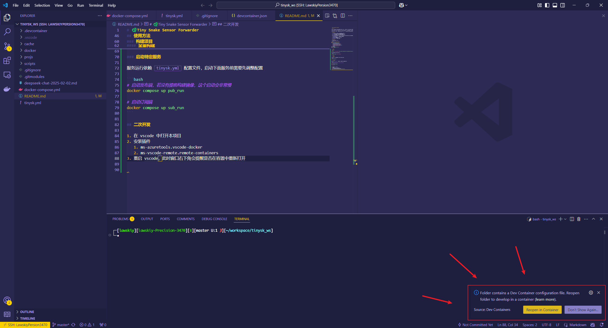
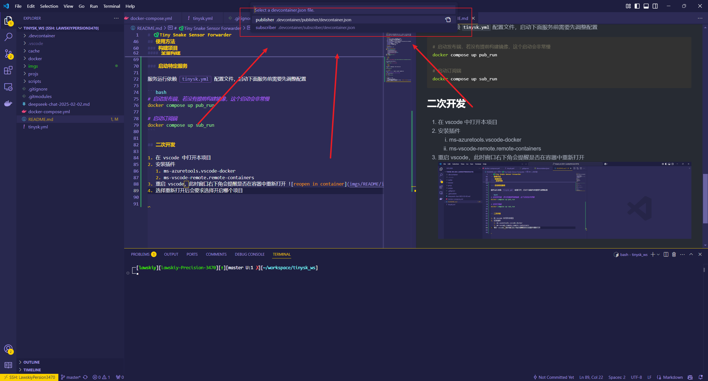

# 🐍Tiny Snake Sensor Forwarder

## 项目简介

本项目为微型生命探测机器人项目的子项目，目的在于驱动传感器并将其通过网络打包发送会远程地面站。项目设计的机器人外观为蛇型机器人，蛇头位置配备摄像头、激光雷达、IMU三种传感器设备。

通信的总体架构为发布者-订阅者架构，机器人为发布者，采集数据后进行发布，地面站是订阅者，负责接收消息。由于项目整体限制传输带宽，因此本项目除 IMU 之外的所有数据都进行了压缩处理。点云进行了一定比例的降采样，视频进行硬件加速的 jpeg 编码。

机器人使用的开发板型号为 **RaspberryPi Zero 2W**，使用基于 aarch64(armv8) Debian12(bookwarm) 的树莓派定制操作系统

## 项目文件说明

- `.devcontainer`: 用于存放基于 vscode 的容器开发配置
  - `pub`: publisher 容器配置，实际部署在机器人的开发板上
  - `sub`: subscriber 容器配置，实际部署在地面站上
- `cache`: 用于开容器的构造结果，请勿手动更改内部文件内容
- `data`: 存放测试数据
- `docker`: 存放镜像配置文件，每个镜像都有三个阶段。base 阶段安装依赖，overlay 阶段编译项目代码，dev 阶段配置开发环境
  - `publisher.Dockerfile`: 为 publisher 配置的镜像
  - `subscriber.Dockerfile`: 为 subscriber 设计的镜像
- `projs`: 存放项目代码
  - `publisher`: 发布者代码，部署在机器人上
  - `subscriber`: 订阅者代码
- `docker-compose.yml`: 服务配置文件

## 使用方法

如果只是使用

1. [克隆项目](#克隆项目)
2. 修改配置文件 `tinysk.yml`
3. [启动目标服务](#启动特定服务)

### 克隆项目

```bash
git clone --recurse-submodules https://github.com/HopeCollector/TinySnakeSensorForwarder.git
```

若已经克隆了项目，可以在项目根目录执行

```bash
git submodule update --init --recursive
```

### 构建项目

#### 全量构建

在项目根目录执行下面指令将构建所有服务，这个会非常慢

```bash
docker compose build
```

### 启动特定服务

服务运行依赖 `tinysk.yml` 配置文件，启动下面服务前需要先调整配置

```bash
# 启动发布端，若没有提前构建镜像，这个启动会非常慢
docker compose up pub_run

# 启动订阅端
docker compose up sub_run
```

## 二次开发

1. 在 vscode 中打开本项目
2. 安装插件
   1. ms-azuretools.vscode-docker
   2. ms-vscode-remote.remote-containers
3. 重启 vscode，此时窗口右下角会提醒是否在容器中重新打开 
4. 选择重新打开后会要求选择开启哪个项目 
5. 选择要开发的项目后会 vscode 会重启，并进入相关的开发容器
